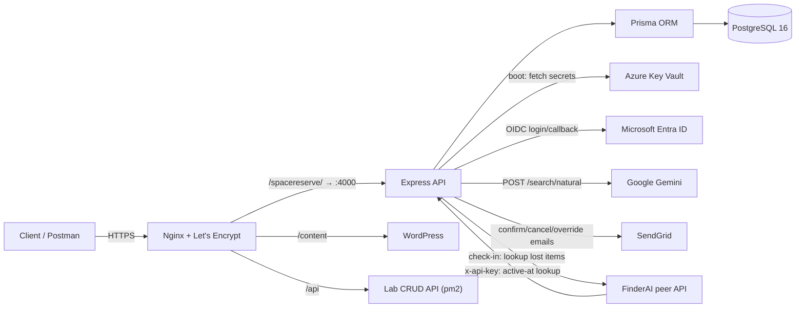
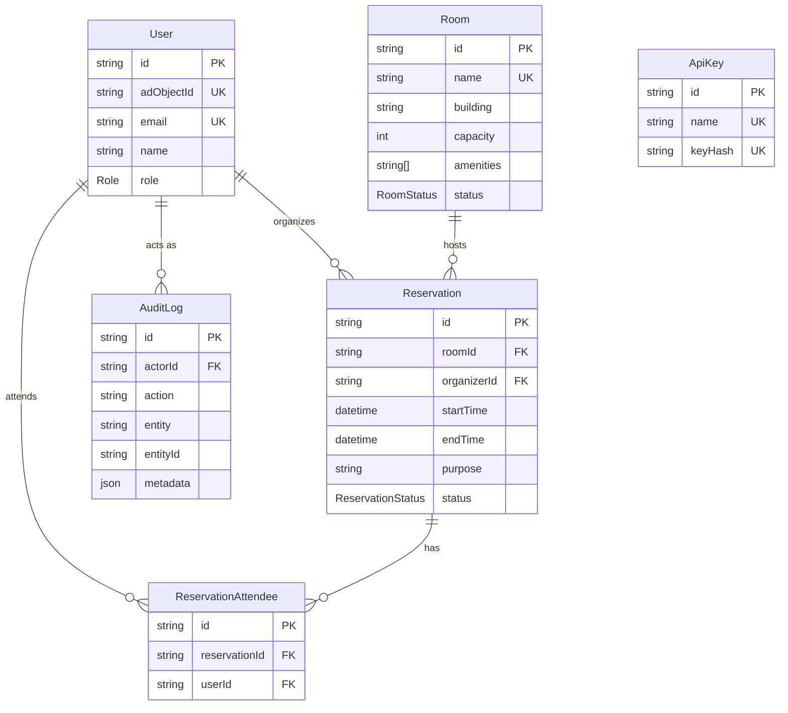

# SpaceReserve — backend

Campus room-booking REST API — final project for **CSX4110 Backend Application Development**,
Assumption University (Vincent Mary School of Engineering, Science and Technology).
Prof. Dr. Chayapol Moemeng · Section 542 · Semester 1/2026.

> This is the graded backend. See the [repo root README](../README.md) for how it fits together
> with [`../frontend/`](../frontend/), the React app built on top of it.

> **Status:** Phases 1–11 (scaffold through tests) are implemented and tested locally. Phase 12
> (live VPS deployment) and the demo video are pending real Azure Key Vault / AD / SendGrid /
> Gemini / FinderAI credentials — see [Configuration & secrets](#configuration--secrets) and
> [Deployment](#deployment).

## What it does

Students and faculty search for open study rooms, project labs, and music practice rooms, book
them, and invite others along. Facility staff manage rooms and override bookings for maintenance.
Admins see audit logs and utilization stats. Nobody sets a SpaceReserve password — sign-in goes
through the university's Microsoft Entra ID (AD) via OIDC, and the API then issues its own JWT.

## Architecture



Everything under `/spacereserve/` is one Express app behind one new Nginx `location` block —
`/content` (WordPress) and `/api` (the lab CRUD API) are untouched.

## Tech stack

| Layer | Choice |
|---|---|
| Runtime | Node.js 20 LTS, TypeScript |
| Web framework | Express 4 |
| Database | PostgreSQL 16 via Prisma ORM (migrations committed, `migrate deploy` in prod) |
| Auth | Microsoft Entra ID (OIDC, `@azure/msal-node`) → our own JWT (`jsonwebtoken`, HS256, 1h) |
| Secrets | Azure Key Vault (`@azure/identity` + `@azure/keyvault-secrets`) — no `.env` in production |
| Validation | Zod on every body/query/param |
| AI | Google Gemini (`@google/generative-ai`) — natural-language room search, JSON-schema constrained |
| Email | SendGrid (`@sendgrid/mail`) — booking confirm/cancel/override |
| Peer integration | FinderAI (campus Lost & Found) — `x-api-key`, both directions |
| Logging | pino (structured, secrets redacted) |
| Hardening | helmet, cors, express-rate-limit, cookie-parser (signed cookies) |
| Tests | Vitest + Supertest, against a real Postgres (local or CI service container) |
| Infra | Docker + Compose, GitHub Actions CI → GHCR, Nginx + Certbot on an Azure VM |

## Data model (ERD)



`Role { STUDENT, STAFF, ADMIN }` · `RoomStatus { AVAILABLE, OUT_OF_ORDER }` ·
`ReservationStatus { CONFIRMED, CANCELLED, OVERRIDDEN }`. Full definitions in
[prisma/schema.prisma](prisma/schema.prisma).

**Business rules** (enforced in the service layer, not the client):

1. No two `CONFIRMED` reservations overlap in a room — checked inside a Prisma transaction.
2. `OUT_OF_ORDER` rooms cannot be booked.
3. Organizer + attendees must not exceed `room.capacity`.
4. Bookings: future only, ≤ 4 hours, ≤ 14 days ahead. (Check-in is exempt from "future only" —
   its own window is 15 minutes before start through the end time.)
5. Only the organizer, STAFF, or ADMIN may cancel a reservation.
6. Every STAFF/ADMIN mutation writes an `AuditLog` row.

## Local setup

Requires Node 20, a local PostgreSQL 16 (or Docker), and Docker for the full compose path.

```bash
cp .env.example .env              # fill in dev values; never commit .env
npm ci
npm run db:migrate                # applies prisma/migrations/ to DATABASE_URL from .env
npm run db:seed                   # 3 users (one per role), 10 rooms, 3 reservations, a dev FinderAI key
npm run dev
curl http://localhost:4000/spacereserve/api/v1/health
```

Expected response once the database is reachable:

```json
{ "status": "ok", "db": "ok", "keyVault": "not_configured", "version": "0.1.0", "uptimeSeconds": 1 }
```

`keyVault` stays `not_configured` outside production — dev/test never contact the vault (see
[Configuration & secrets](#configuration--secrets)).

Or with Docker (brings up its own Postgres container):

```bash
cp .env.example .env
docker compose up --build
```

Try it without a real Entra tenant using the dev-only login (hard-disabled when
`NODE_ENV=production`):

```bash
curl -X POST http://localhost:4000/spacereserve/api/v1/auth/dev-login \
  -H 'Content-Type: application/json' \
  -d '{"email":"admin@spacereserve.dev","role":"ADMIN"}'
```

### Tests

```bash
npm test
```

Runs against a real Postgres (`spacereserve_test` — see `TEST_SECRETS.databaseUrl` in
[src/config/index.ts](src/config/index.ts)), matching the service container CI spins up. Test
files run sequentially (`fileParallelism: false` in `vitest.config.ts`) because several call a
shared `resetDb()` helper against that one database — running them in parallel let one file's
reset wipe rows another file was mid-assertion on.

### Scripts

| Script | Does |
|---|---|
| `npm run dev` | Watch-mode dev server (tsx) |
| `npm run build` | Compile TypeScript to `dist/` |
| `npm start` | Run the compiled server |
| `npm run lint` / `lint:fix` | ESLint |
| `npm run typecheck` | `tsc --noEmit` |
| `npm run check:env` | Fails if `process.env` is read outside `src/config/` |
| `npm test` / `test:watch` | Vitest + Supertest |
| `npm run db:migrate` | `prisma migrate dev` (local only — never on the server) |
| `npm run db:seed` | Runs `prisma/seed.ts` |
| `npm run db:studio` | Prisma Studio |

## Configuration & secrets

Production has **no `.env` file**. Every secret is fetched from Azure Key Vault at boot
(`src/config/keyvault.ts`), and the app **refuses to start** if the vault is unreachable — this
is deliberate and is the behavior demoed in the video. The only environment variables production
receives are the three Azure bootstrap values (`AZURE_TENANT_ID`, `AZURE_CLIENT_ID`,
`AZURE_CLIENT_SECRET`).

Secret **names only** — values live in the vault:

| Key Vault secret | Holds |
|---|---|
| `SpaceReserve-DatabaseUrl` | Postgres connection string |
| `SpaceReserve-JwtSecret` | JWT signing key (also signs the OIDC state / PKCE cookies) |
| `SpaceReserve-AdClientId` | Entra app registration client id |
| `SpaceReserve-AdClientSecret` | Entra app registration client secret |
| `SpaceReserve-GeminiApiKey` | Google Gemini |
| `SpaceReserve-SendGridApiKey` | SendGrid |
| `SpaceReserve-FinderAIApiKey` | Key issued to us by the FinderAI team |
| `SpaceReserve-PeerApiKeyHash` | Bootstrap hash of the key we issue FinderAI |

Non-secret, but kept in the same table so a tenant swap is one obvious place: **AD tenant id** —
AU's real Entra tenant is `c1f3dc23-b7f8-48d3-9b5d-2b12f158f01f`, but that tenant has no app
registration for us yet. A personal Entra tenant is used for development until AU's is issued;
the demo uses whichever tenant id is set in `AD_TENANT_ID`.

`.env.example` mirrors this table with empty values for local development. Every integration
degrades gracefully rather than 500ing when its secret is unset: `/auth/login` returns a clear
503, Gemini search falls back to keyword search (`degraded: true`), SendGrid failures are logged
without failing the booking, and FinderAI lookups return `lostItemNotice: null`.

## API reference

Base path: `/spacereserve/api/v1`. Full request/response examples in
[docs/api.md](docs/api.md).

| Method & path | Auth | Notes |
|---|---|---|
| `GET /health` | none | `{status, db, keyVault, version, uptimeSeconds}` |
| `GET /auth/login` | none | Redirects to Microsoft; 503 if AD isn't configured |
| `GET /auth/callback` | none | PKCE/state cookie check; redirects to `FRONTEND_URL` if set, else JSON; `?mode=json` always returns `{token}` |
| `GET /auth/me` | any role | Current user |
| `POST /auth/refresh` | any role | Re-issues while still valid (not rotation) |
| `POST /auth/logout` | none | Clears the session cookie; idempotent |
| `POST /auth/dev-login` | none | **Dev/test only** — 404s in production |
| `GET /rooms` | any role | Filters: `capacity`, `building`, `amenities`, `availableFrom`/`availableTo` |
| `GET /rooms/:id` | any role | |
| `POST /rooms` | STAFF, ADMIN | Audited |
| `PATCH /rooms/:id` | STAFF, ADMIN | Audited |
| `PATCH /rooms/:id/status` | STAFF, ADMIN | Audited |
| `DELETE /rooms/:id` | STAFF, ADMIN | 409 if the room has reservations; audited |
| `GET /users?email=` | any role | Exact-match lookup, for inviting attendees by email |
| `POST /reservations` | any role | Overlap/capacity/out-of-order/window checks |
| `GET /reservations/mine` | any role | Organized or attending |
| `GET /reservations/:id` | organizer, attendee, STAFF, ADMIN | |
| `DELETE /reservations/:id` | organizer, STAFF, ADMIN | Cancels; staff action audited |
| `POST /reservations/:id/override` | STAFF, ADMIN | Audited, emails organizer |
| `POST /reservations/:id/check-in` | organizer | 15 min before start → end; queries FinderAI |
| `POST /reservations/:id/attendees` | organizer | |
| `DELETE /reservations/:id/attendees/:userId` | organizer | |
| `POST /search/natural` | any role | Rate-limited 10/min per user |
| `GET /admin/audit-logs` | ADMIN | `?limit=` (default 100, max 500) |
| `GET /admin/stats/utilization` | ADMIN | Per-room booked hours |
| `GET /external/bookings/active-at` | `x-api-key` | Peer-facing — see below |

### RBAC matrix

✅ allowed · — not applicable/self-checked in the service layer (e.g. "own reservation only")

| Endpoint | STUDENT | STAFF | ADMIN |
|---|---|---|---|
| `GET /rooms`, `GET /rooms/:id` | ✅ | ✅ | ✅ |
| `POST/PATCH/DELETE /rooms*` | ❌ | ✅ | ✅ |
| `GET /users` | ✅ | ✅ | ✅ |
| `POST /reservations` | ✅ | ✅ | ✅ |
| `GET /reservations/mine`, `GET /reservations/:id`\* | ✅ | ✅ | ✅ |
| `DELETE /reservations/:id`\* | own only | ✅ any | ✅ any |
| `POST /reservations/:id/override` | ❌ | ✅ | ✅ |
| `POST /reservations/:id/check-in`, attendee management | organizer only | organizer only | organizer only |
| `POST /search/natural` | ✅ | ✅ | ✅ |
| `GET /admin/*` | ❌ | ❌ | ✅ |

\* `GET`/`DELETE /reservations/:id` also allow the reservation's organizer or an invited attendee
regardless of role — ownership is checked in `reservations.service.ts`, not by `requireRole`.

Covered by `tests/rooms.test.ts`, `tests/reservations.test.ts`, and `tests/admin.test.ts`.

## Peer API — Finder Portal (FinderAI)

Partner: **Finder Portal (FinderAI)**, campus Lost & Found. Full contract in
[docs/peer-api.md](docs/peer-api.md).

- **We expose** `GET /spacereserve/api/v1/external/bookings/active-at?room=<name>&at=<ISO
  datetime>`, authenticated with a static key FinderAI sends as `x-api-key`. When they log a
  found item in a room, they call this to learn who had it booked at that time, so they can
  notify the likely owner. Returns the organizer's name/email and attendee count — the minimum
  needed — or `{"reservation": null}`. Rate-limited 60 req/min per key.
- **We consume** FinderAI's `GET /api/v1/items/by-location`, authenticated with the key *they*
  issue us (`SpaceReserve-FinderAIApiKey` in Key Vault), from `POST /reservations/:id/check-in`.
- **Status:** their real endpoint/response contract isn't final yet, so
  [src/integrations/finderai.ts](src/integrations/finderai.ts) defines the client behind an
  interface with a local mock — check-in already works end to end and returns
  `lostItemNotice: null` until the real client is wired in. Target dates (DECISIONS.md #11):
  contract frozen 28 Aug, keys exchanged 4 Sep, joint end-to-end test 16 Sep.
- **Keys:** each side generates a 32-byte random hex key for the other, stores only its SHA-256
  hash (`ApiKey.keyHash`), and never logs or commits the raw value.

## Deployment

Target: `azureuser@20.2.140.191` (Azure VM, East Asia), domain
`ratchanon-bad2026.eastasia.cloudapp.azure.com`, app on port 4000 (3000 is the existing lab API).

- **Images are never built on the VM** — GitHub Actions builds and pushes to
  `ghcr.io/u6610909/spacereserve` on every push to `main` ([.github/workflows/ci.yml](../.github/workflows/ci.yml)).
- **Nginx**: paste [nginx/spacereserve.conf](nginx/spacereserve.conf) into the existing SSL
  server block — a new `location /spacereserve/` only, `/content` and `/api` untouched. Reuse the
  existing Let's Encrypt cert.
- **Compose**: [docker-compose.prod.yml](docker-compose.prod.yml) runs a single `api` container
  (Postgres is Azure Database for PostgreSQL Flexible Server in prod, not a container —
  see `DECISIONS.md`), bound to `127.0.0.1:4000` only.
- **Deploy**: [`./deploy.sh`](deploy.sh) — pulls the image, runs `prisma migrate deploy` in a
  one-off container, restarts, waits for `/health`, and rolls back to the previous image tag on
  failure. Idempotent, `set -euo pipefail`.
- **VPS hardening**: UFW (22/80/443 only), SSH key-only, fail2ban, unattended upgrades, non-root
  app user, swap configured.

**Live URL:** not yet deployed — blocked on the class Azure Key Vault URL and service principal,
which the professor has not issued yet (see CLAUDE.md's "Still blocked" list). The application
boots and refuses to start without it by design; that failure mode is what the demo video shows
until real credentials land.

## Contributing

See **[TEAM.md](../TEAM.md)** — branch per phase, pull request into `main`, CI must pass before
merge, and no direct commits to `main`.

## Team

| Name | Student ID |
|---|---|
| Ratchanon P. | 6610909 |
| Badin Bangsen | 6611108 |
| Warachai A. | 6610996 |
